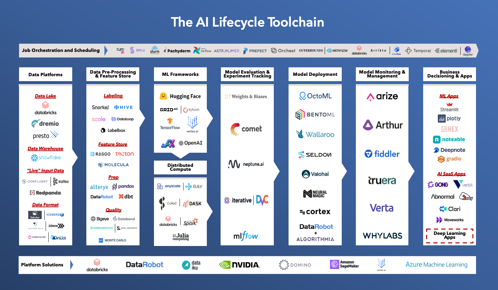

# bootcamp 🎓🚀

Lecture notes, readings, code samples and resources for [Brad Flaugher's Data-Focused Programming Bootcamp](https://bradflaugher.com/bootcamp.html)


# Course Outline 📝


**Duration**: 6 Weeks (with 1 week break for Thanksgiving/Project Work)

**Lectures**: Tuesdays and Thursdays @ 1pm Eastern (via Google Meet, also recorded)

**Office Hours**: Thursdays (book time via [Brad's Calendar](https://calendar.app.google/AGTTsgwD5LPnwvfJ7))

**2023 Cohort**: [see particpants.txt](./participants.txt)

| Session   | Content |
|-----------|---------|
| 📅 Week 1 | 📚 [Lecture 1: Introduction to Data and AI roles, Basics of Machine Learning and AI, Tech Stack Overview](#intro---the-30000-foot-view-of-data-and-ai-%EF%B8%8F)|
| 📅 Week 1 | 🎬 ["Foundations" Live Demos](#foundations-) |
| 📅 Week 2 | 💡 [Final Project Ideas](#final-project-ideas-)
| 📅 Week 2 | 📊 [Lecture 2: Universal Machine Learning Workflow](#the-universal-machine-learning-workflow-) |
| 📅 Week 3 | 👥 Pair Programming, Project Q&A |
| 📅 Week 3 | 📝 [Lecture 3: Data Engineering, ETL Basics](#etl-and-its-all-numbers-man-) |
| 📅 Week 4 | 👥 Pair Programming, Project Q&A |
| 📅 Week 4 | 📊 [Lecture 4: Data Wrangling Techniques](#data-wrangling-) |
| 📅 Week 5 | 👥 Pair Programming, Project Q&A |
| 📅 Week 5 | 🧠 [Lecture 5: Deep Learning in Detail: Metrics and Loss Functions, Model Architecture and Hyperparameters](#neural-network-model-architecture-) |
| 📅 Week 6 | 🦃 Thanksgiving Break |
| 📅 Week 7 | 👥 Pair Programming, Project Q&A |
| 📅 Week 7 | 🎓 [To The Moon! After The Bootcamp...](#after-the-bootcamp-) |
| 📅 Weeks 7-8 | 🎉 [Project Presentations](https://www.youtube.com/@bradflaugher2452/videos), scheduled outside of class time |
 
*Schedule is tentative and may be adjusted.*

# Preparation 🎒

If you want to do well in the bootcamp it is best to come prepared. Students who have installed Linux, spent an hour learning python basics, and an hour learning git/command line bascis are much more likely to succeed and get a sweet job after the course.

| **Preparation Step**                                     | **Requirement** | **Expected Time to Complete** | **Notes**                                                  | **Links**                                                                                         |
|----------------------------------------------------------|-----------------|-------------------------------|------------------------------------------------------------|---------------------------------------------------------------------------------------------------|
| 📚 Read and Practice Command-Line Basics                 | ✅ Required     | 1-2 hours                     | Essential for effective course navigation                 | [Terminal Commands](https://www.techrepublic.com/article/16-terminal-commands-every-user-should-know/) |
| 🛠️ Setup GitHub Account and Learn Git                   | ✅ Required     | 2-3 hours                     | If you get stuck on this, Brad will help in class #2 or office hours | [Git Fundamentals](https://www.youtube.com/watch?v=RGOj5yH7evk)                            |
| 🐍 Learn Basics of Python                               | ✅ Required     | 2+ hours                     | Recommended if new to Python coding                       | [Futurecoder.io course](https://futurecoder.io/course/)                                     |
| 💻 Setup Laptop/PC with Ubuntu GNU/Linux               | 🔄 Not Required | 1-2 hours                     | Consider for an optimal experience                        | [Ubuntu Install Guide](https://ubuntu.com/tutorials/install-ubuntu-desktop#1-overview)       |
| 🖥️ Dual-Boot Alongside Windows                          | 🔄 Not Required | 2-3 hours                     | Use an amd64-based PC for better results                 | [Additional notes for dual-booting with Windows](https://linuxconfig.org/how-to-install-ubuntu-20-04-alongside-windows-10-dual-boot) |
| 🐳 Install Docker                                      | 🔄 Not Required | 1-2 hours                     | Install Docker for advanced projects                     | [Install Docker](https://docs.docker.com/engine/install/)                                     |

---

# Intro - The 30,000 foot view of Data and AI 🛰️

* AI Tutors and [the modified CS50 approach](./cs50.pdf), also see a [7 minute video describing their approach](https://youtu.be/MYnoZP9ZggI?si=bBZUEKZ7bRNzg7jJ)
* Definitions: Data Scientist, Data Engineer, Data Analyst, Data Janitor 🧑‍💻
* Definitions: Machine Learning and Artificial Intelligence 🧠💡
* Why Neural Networks? [Single Cell Neural Network aka Regression in Excel](./simple_nn.xlsx) 📈
* Intro to Foundation Models: ImageNet, BERT, LLaMA and Stable Diffusion 🌐
* Hacker Culture ([For Fun and Profit](https://www.penguinrandomhouse.com/books/657764/for-fun-and-profit-by-christopher-tozzi-foreword-by-jonathan-zittrain/)):
  - 🌐 Access to computers – and anything that might teach you something about the way the world works – should be unlimited and total. 📚💻
  - 🔓 All Information Should Be Free. 📖🆓
  - 🚫 Mistrust Authority – Promote Decentralization. ⚖️🌍
  - 🔍 Hackers should be judged by their hacking, not bogus criteria such as degrees, age, race, or position. 👨‍💻🕵️‍♂️
  - 🎨 You can create art and beauty on a computer. 🎨💻✨
  - 💡 Computers can change your life for the better. 🖥️🌟
* Question: Do we buy or build? Which of these tools should we use?

* Answer Our *Freedom* & [*Popularity*](https://survey.stackoverflow.co/2023/#technology-admired-and-desired) Stack:
  - 🖥️ OS: Linux (Preferred), macOS (w/ UNIX tools), Windows (w/ Windows Subsystem for Linux)
  - 👩‍💻 Programming Language: Python (and Matplotlib, seaborn, pandas and numpy as important libraries we'll see)
  - 📚 ML Library: PyTorch, Tensorflow
  - 🗃️ Data Storage: SQL* (Anything we can access w SQL is fine at this point we wont really care what database our data is in for now, in this course we won't get much SQL practice but we need to know it so we can access data in Postgres, BigQuery, Athena, MySQL, Tableau, PowerBI etc...)
  - 🛠️ Version Control: Git (and github)
  - 📝 IDE/Editor: VSCode, Jupyter Notebook or [```vim```](https://www.youtube.com/watch?v=rysgxl35EGc)
  - ☕ Training and Testing Models: Google Colab
  - 🚀 Multi-Environment Testing and Deployment: Docker
  - ☁️ Cloud Services: AWS, Azure or Google Cloud
* Why Python? [Python and C Speed Test](./speed_test/) 🐍💨
* [Innovation Horizons 1,2 and 3...](https://www.boardofinnovation.com/blog/what-is-the-3-horizons-model-how-can-you-use-it/) reasons to stay small.

## Readings 📖
* [Intro to Deep Learning](https://www.youtube.com/watch?v=qj5gUDJ5TnU) 🎬
* [Intro to Free Software (TEDx Geneva)](https://www.fsf.org/blogs/rms/20140407-geneva-tedx-talk-free-software-free-society)

---

# Foundations ⚙
 
> "When you don’t have a setup, there are many times when you get the inspiration, the idea, but you have no tools, no place to put it together. And the idea just sits there and festers. Over time, it will go away. You didn’t fulfill it—and that’s just a heartache." [David Lynch](https://rhystranter.com/2016/02/22/david-lynch-on-having-a-setup/)

## Live Demos 🙋‍♂️🙋‍♀️🙋
* [ ] Start a Github Project 🏁
* [ ] Commit from the command line 📤* [ ] Write a basic bash script
* [ ] [Run a docker container🏃‍♂️ run bash from a container?](docker_lecture.md)
* [ ] Run python code
* [ ] pip install
* [ ] Load a csv file into pandas 🐼
* [ ] Inspect a large csv file in the command line 🕵️‍♂️
* [ ] Start and close vim 🗒️
* [ ] Answer any programming question with an LLM �
* [ ] [Ace the interview](./interviews/)?

## TODOs
* [Watch The SuperDataScience Code Interpreter Guide](https://youtu.be/ac6580tuveo?si=dUlyNu1CzFkhDPek)
* Make sure you have access to an LLM:
  - **GPT-4 is currently the best at software development** access [GPT-4 via Bing](https://www.bing.com/search?q=Bing+AI&showconv=1&FORM=hpcodx), [ChatGPT](https://chat.openai.com/) or [gpt4free](https://github.com/xtekky/gpt4free) OR use [Medusa Interpreter](https://github.com/Medusa-ML/Interpreter) with the GPT-4 API or CodeLLaMA
  - **BUT there are other very good models out there** feel free to experiment with (in recommended order) [HuggingChat](https://huggingface.co/chat/), [Claude](https://claude.ai/chats), [Bard](https://bard.google.com/chat), [Phind](https://www.phind.com/) or whatever else you can access easily (like this [cool thing](https://chat.lmsys.org/?arena).

---

# Final Project Ideas 🚀

Bootcampers will spend a tremendous time working on final projects that are targeted to the bootcamper's career goals. For an example final presentation see [Oleh's Video (YouTube)](https://www.youtube.com/watch?v=I-KL-mWF548) and [Oleh's Repository (GitHub)](https://github.com/MorhaliukOL/ML_Project). 🎥🎞️📁 You can also see more final project presentations and source code on [Brad's Youtube Channel](https://www.youtube.com/@bradflaugher2452/videos). 📺👨‍💻

* ⭐⭐⭐ [Use Scikit-LLM to categorize some text](https://github.com/iryna-kondr/scikit-llm) 📚
* ⭐⭐⭐ [AWS Machine Learning Certification](https://aws.amazon.com/certification/certified-machine-learning-specialty/) or [Google Machine Learning Certification](https://cloud.google.com/learn/certification/machine-learning-engineer) 🏅
* ⭐⭐⭐ [Tensorflow Text Classifier Tutorial](https://www.tensorflow.org/tutorials/keras/text_classification) or [Tensorflow Image Classifier Tutorial](https://www.tensorflow.org/tutorials/keras/classification) 🏷️
* ⭐⭐⭐⭐ [PyTorch Text Classifier](https://pytorch.org/tutorials/intermediate/char_rnn_classification_tutorial.html) 📖 or [PyTorch Lightning Classifier](https://lightning.ai/docs/pytorch/stable/starter/introduction.html)
* ⭐⭐⭐⭐ [Deploy and Fine-Tune your own Open-Source LLM with Medusa Alchemy](https://github.com/Medusa-ML/Alchemy)
* ⭐⭐⭐⭐[Fine-Tune a Pretrained Model w/ Huggingface](https://huggingface.co/docs/transformers/training) either [Text](https://huggingface.co/docs/transformers/tasks/sequence_classification) or [Images](https://huggingface.co/docs/transformers/tasks/image_classification) 🔧
* ⭐⭐⭐⭐⭐[Replicate a Winning Model from Kaggle](https://www.kaggle.com/code?types=competitions) 🏆

## TODOs
* Pick a Project!
* Be ready to tell us about it!

---

# The Universal Machine Learning Workflow 🔄

## [The Workflow](./the_universal_ml_workflow.pdf), from Chapter 6 of "Deep Learning with Python" also on [O'Reilly](https://www.oreilly.com/library/view/deep-learning-with/9781617296864/Text/06.xhtml) 🔄

1. Define the Task
   - Collect a Dataset
   - Understand Your Data
   - Choose a Measure of Success 

2. Develop a Model
   - Prepare the Data 
   - Choose an Evaluation Protocol
   - Beat a Baseline (does it beat the random model?)
   - Develop a model that overfits
   - Regularize and Tune Your Model

3. Deploy the Model
   - Explain Your Work to Your Stakeholders and Set Expectations
   - Ship an Inference Model
   - Monitor Your Model in the Wild
   - Maintain Your Model

## The Regression Theory of Everything, [Chapter 3 of "AI Harmony"](./AI_harmony_c3.pdf)

* What Are Deep Learning Models?
  - Large data-driven functions
* What Are Their Key Features
  - Complex and unpredictable
  - Sensitive to small input changes
  - Hard to explain or test
* What Do Data Scientists Spend Time On?
  - Data collection and organization
  - Limited experimentation
  - They should also celebrate successes, but highlight failures and limitations (this is hard)

## Video [How Deep Learning Works](https://www.youtube.com/watch?v=wBgW3ZtlPT8) 🎬

---

# ETL and "It's all numbers, man" 🧮

* ETL: aka Download, change, upload... give command line example with wget csv, python change units, s3 upload. ⬇️⬆️
* Why is it hard to learn ETL? is ETL a legacy problem? How many data sources can there possibly be? 🤔
* Demonstration: [Numbers are Data](/data_types/data_loading_preprocessing.ipynb) 🔢
* Demonstration: [Text are Data](/data_types/data_loading_preprocessing.ipynb) 📜
* Demonstration: [Images are Data](/data_types/data_loading_preprocessing.ipynb) 🖼️
* Pandas: what is it and why do we use it? 🐼
* Discussion: Data Collection, ETL and "glue code" 🗂️

---

# Data Wrangling 📊

* Scraping Data 🕷️
* APIs 🖥️
* Python Requests 📬
* Combining Datasets 📚
* Synthetic (AI-Generated) Datasets 🤖
* Important Data Sources 📑
  - Free captioned images from the web, [LAION](https://laion.ai/) 🌐
  - The entire web, scraped for you, [Common Crawl](https://commoncrawl.org/) via [comcrawl](https://github.com/michaelharms/comcrawl) 🕸️
  - More specialized data... [Datahub](https://datahub.io/collections) and [Awesome pubilc datasets](https://github.com/awesomedata/awesome-public-datasets) and [Huggingface Datasets](https://huggingface.co/datasets) and [Huggingface](https://huggingface.co/docs/datasets/tutorial) 📚

---

# Neural Network Model Architecture 🧠

* Definition: [Accuracy](https://medium.datadriveninvestor.com/accuracy-trap-pay-attention-to-recall-precision-f-score-auc-d02f28d3299c), [Precision, Recall, F1](https://emkademy.com/research/toolbox/2020-03-02-accuracy-precision-recall), [AUC](https://paulvanderlaken.com/2019/08/16/roc-auc-precision-and-recall-visually-explained/) 🎯
* Definition: [Confusion Matrix](https://www.statology.org/confusion-matrix-python/)... [in Tensorflow too](https://www.tensorflow.org/tutorials/audio/simple_audio#display_a_confusion_matrix) 🔍
* Discussion: Loss functions vs model metrics? 📊
* Discussion: How do you measure model performance with other ML techniques? (Back to Excel Nerual Net for a moment) then [Custom Loss Functions](https://stackoverflow.com/questions/53980031/pytorch-custom-loss-function) and [Custom Loss Functions #2](https://discuss.pytorch.org/t/custom-loss-functions/29387/3) 💹
* Discussion: "The Price is Right" Loss Function? 💰
* Discussion: Layer Types and Standard or Template Models 🧩
* Demo: [Let's review some "Example" models, AKA stuff you might see in industry](./example_models)
* Discussion: Where to start, how to adjust hyperparameters 🎛️
* Discussion: How can you steal ideas? 

## Readings
* [Modeling Natural Language](https://www.youtube.com/watch?v=rqyw06k91pA)

---

# After The Bootcamp 🎓

## Use a Dynamic Cheat Sheet
* [Brad's Cheat Sheet](https://bradflaugher.com/cheat.html)
* [The Book of Secret Knowledge](https://github.com/trimstray/the-book-of-secret-knowledge)
* [Interview Questions and Exercises](https://github.com/bregman-arie/devops-exercises)

## Improve your SQL
* Take the [Interactive SQL course @ Codecademy](https://www.codecademy.com/learn/learn-sql) 💾
* OR learn about [BigQuery (which is queried via SQL)](https://codingisforlosers.com/learn-bigquery-sql/)

## Brad's Favorite Free Learning Resources 🎯
* [Tensorflow Tutorials](https://www.tensorflow.org/tutorials)
* [PyTorch Tutorials](https://pytorch.org/tutorials/)
* [HuggingFace Course on Transformers](https://huggingface.co/course/chapter0/1?fw=pt)
* [Github Trending Repos](https://github.com/trending)
* [Kaggle Winners Code](https://www.kaggle.com/code?types=competitions)
* [Airflow Tutorial for Beginners](https://www.youtube.com/watch?v=K9AnJ9_ZAXE) 🎬
* [Freecodecamp Pandas 10 hour course](https://www.freecodecamp.org/news/how-to-analyze-data-with-python-pandas/) 📚

## Paid Resources 💰
* O'Reilly [Expert Playlists](https://learning.oreilly.com/playlists/discover/) also try accessing through your local [University Library (e.g Penn)](https://franklin.library.upenn.edu/catalog/FRANKLIN_9931899103503681)
* Coursera's [Data Analyst, Data Engineering or Data Science Career Certificates](https://www.coursera.org/career-academy?trk_ref=camodule) 

## Recommended Mailing lists and online groups 📧💻
* [Deep Learning Weekly](https://www.deeplearningweekly.com/)
* [Reddit Machine Learning](https://www.reddit.com/r/MachineLearning/)

## Recommended Professional Groups 👥
* [ACM](https://www.acm.org/)
* [Women in Data](https://www.womenindata.org/)

## Job Boards and Gigs 📋
* [LinkedIn](https://www.linkedin.com/)
* [Wellfound](https://wellfound.com/role/r/machine-learning-engineer)
* Hacker News "Who's Hiring" Thread [Sample Post](https://news.ycombinator.com/item?id=33818037) and [Collection of all posts](https://hnhiring.com/)
* [Turing](https://www.turing.com/)
* [Indeed](https://www.indeed.com/)
* [Toptal](https://www.toptal.com/)
* [RemoteOK](https://remoteok.io/)
* [StackOverflow Jobs](https://stackoverflow.com/jobs/)
* [TopCoder](https://www.topcoder.com/)
* [Experfy](https://www.experfy.com/)
* [Upwork](https://www.upwork.com/)

## Salary Comparison Tools 💰
* [Levels.fyi](https://www.levels.fyi)
* [Stack Overflow Developer Survey (#work-salary)](https://survey.stackoverflow.co/2022/#work-salary)

## On-Demand Help 🆘
* [Patreon](https://www.patreon.com/bradflaugher)
* [Wyzant](https://www.wyzant.com/) or [Brad's Wyzant](https://www.wyzant.com/Tutors/bradmachinelearning)
* [Codementor](https://www.codementor.io/) or [Brad's Codementor](https://www.codementor.io/@bradflaugher)

## Competitions 🏆
* [Kaggle](https://www.kaggle.com/competitions)
